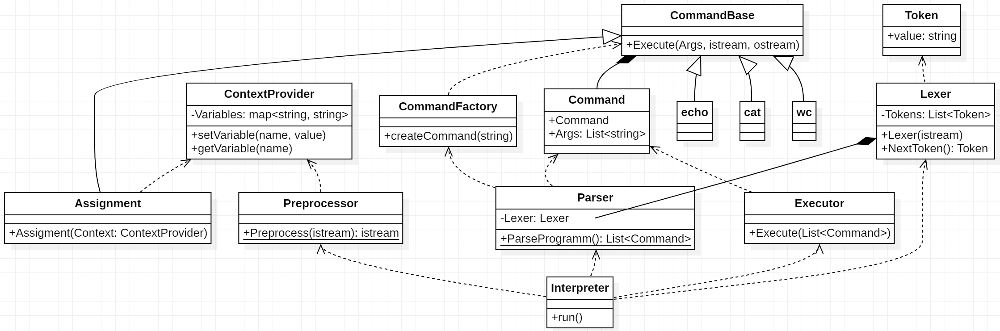

# CLI

Авторы:

- Шакиров Игорь
- Чучин Дмитрий

# Краткое описание работы CLI

Основной класс **Interpreter**, он запускает интерпретатор и ждет, пока пользователь введет команду.

Затем входной поток передаётся **Preprocessor**, который при необходимости заменяет любые вхождения переменных,
обозначенных символом «$», соответствующими значениями.

Полученная обработанная строка передаётся **Lexer**, он разбивает ее на токены в виде односвязного списка и
предоставляет
их в качестве итератора с помощью команды NextToken() (итератором выступает сам лексер).

Полученный Lexer передается в качестве аргумента конструктора классу **Parser**, который проходится по токенам и
инициализирует список команд **Command** в виде массива. Поскольку команды в shell выполняются последовательно, соседние
элементы массива соединяются с помощью механизма Pipeline.

Полученный массив команд затем передается **Executor**, который исполняет команды.

Сами команды **CommandBase** принимают список аргументов, поток ввода и поток вывода. Executor гарантирует, что поток
вывода одной команды станет потоком ввода следующей команды. Сами команды используют как список аргументов, так и поток
ввода.

Результатом Executor является выходной поток и логическое значение, указывающее, следует ли выйти из интерпретатора.
Класс Interpreter получает этот результат и ожидает следующей команды, если команды выхода не было.

# Диаграмма классов

### Interpreter

Приложение-интерпретатор ожидает ввода пользователем команды и выполняет четыре этапа обработки входной строки:
предварительная обработка, лексический анализ, разбор команд и выполнение команд. Если на любом из этих этапов возникает
ошибка, приложение уведомляет пользователя и ожидает новой команды.

### Preprocessor

Препроцессор обрабатывает строку посимвольно следующим образом:

* если очередной символ не $, ' или ", то он будет проигнорирован препроцессором;
* если очередной символ $, то:
    * препроцессор жадно попытается прочитать полное имя переменной, пока не встретит символ, которого не может быть в
      имени
      переменной ([подробнее про имена](https://www.gnu.org/software/bash/manual/html_node/Definitions.html#index-name))
      ;
    * если имя есть в **ContextProvider**, то вместо символа $ и имени переменной подставляется строковое значение из
      контекста, иначе подставляется пустая строка
* если очередной символ ', то пока не будет встречено ' препроцессор будет игнорировать символы " и $;
* если очередной символ ", то пока не будет встречено " препроцессор будет игнорировать символ '.

### Lexer

**Lexer** берет предварительно обработанную строку и представляет ее как односвязный список токенов. Токен — это
строковое
представление команды, аргумента команды или пайплайна. Например, "cat example.txt | wc" будет представлено
как ["cat", "example.txt", "|", "wc"]. После обработки лексер содержит указатель на первый токен.

### Parser

Парсер итерируется по лексемам, которые создал **Lexer**. Он отделяет лексемы каждой из
команд пайпа друг от друга по символу |. Каждый массив лексем, который относится
к одной команде, парсер передает в **CommandFactory**, чтобы получить объект **Command**.
Объекты **Command** парсер объединяет в массив.

Синтаксический анализатор сначала считывает команду, создает объект CommandBase и инициализирует команду. Затем он
добавляет аргументы, пока не встретит пайплайн. После встречи с '|' или концом списка токенов, результирующая команда
добавляется в массив. Процесс повторяется, если остались токены.

### CommandFactory

**CommandFactory** из переданного массива лексем выделяет имя команды, оно записано первым элементом массива,
затем он определяет какой именно объект команды ему нужно создать, после чего создает его.
В конструктор команды оставшиеся лексемы передаются в качестве аргументов.

**FIX**: Этот объект берет имя команды и сначала ищет внутреннюю команду. Если команда не найдена, выполняется поиск
внешней команды. Если команда найдена, она возвращает наследника CommandBase.

### Executor

**Executor** получает на вход массив объектов **Command**, которые запускаются последовательно одна
за другой. Каждая команда среди аргументов метода Execute получает на вход входной и выходной потоки.
Первой команде в качестве входного потока передается stdin, а последней команде в качестве выходного потока
передается stdout. Остальные входные и выходные потоки создаются отдельно
и передаются так, чтобы выходной поток текущей команды был тем же, что и входной поток следующей команды.

# Диаграмма последовательности

На данной диаграмме изображено время жизни каждого объекта и их взаимодействие в каждой итерации - ввода команды
пользователем.

# Тонкости

### Присваивание

Мы решили реализовать присваивание как команду. Однако она отличается от остальных тем, что в конструктере принимает
ContextProvider для того, чтобы записывать туда значение переменной.

### Команда exit

exit также является командой, которая читает входной поток и игнорирует его, выводя пустую строку.
Однако требуется, чтобы Executor проверял - если всего команд 1 в массиве и это exit, то возвращал в Iterpreter сигнал о
завершении работы.

### CommandFactory и вызов внешних команд

Внешние команды также являются наследником Command. (пока под вопросом) Создаётся ExternalCommand, который принимают
Process(или его аналоги).

# Обработка ошибок

Чтобы обеспечить приемлемую обработку ошибок, мы решили выполнять все основные этапы внутри интерпретатора. Если на
каком-либо шаге возникают какие-либо проблемы, программа выводит информацию об ошибке. Примеры включают:

- Некорректный ввод команды: синтаксический анализатор попросит CommandFactory создать команду, но если он не распознает
  команду, он выдаст исключение. Затем синтаксический анализатор перебросит исключение с сообщением «Неизвестная
  команда».
- Неизвестное имя переменной - Препроцессор обнаружит переменную и попросит ContextProvider значение переменной, но если
  команда не найдена, выдаётся исключение с сообщением "Переменная не найдена"
- Неверное количество аргументов - Парсинг пройдёт успешно и передаст команды Executor. При выполнении команды, **
  команда обязуется проверять корректность переданных аргументов** и выбрасывать исключение.
- (под вопросом) Запись вида "abc =45" - ["abc", "=45"] - ошибка неизвестная команда. "abc= 53" - ["abc=", "", "53"]
  неизвестная команда "53". Тут ещё надо подумать, как лучше представить присваивание как токен,
  мб ["=", "v_name", "v_value"]. Ошибка парсинга\лексера.

# Ответы на важные вопросы, кратко

### Как предствавляются команды и пайплайны?

Есть абстрактный класс **CommandBase**, который определяет виртуальный метод Execute(). Каждая команда должна
реализовать этот метод.

Пайплайн представлен как разделитель соседних элементов массива команд, который возвращает Parser.

### Как создаются команды?

С помощью объекта CommandFactory.

### Как они исполняются? Как взаимодействуют потоки в пайплайне?

Метод Execute() принимает аргументы, поток ввода и вывода. Следовательно, взаимодействие пайплайнов происходит за счёт
записи в поток вывода одной команды, который читается следующей командой.

### Кто и как выполняет разбор входной строки?

Preprocessor для подстановки, Lexer для разбора строки.

### Как представляются переменные окружения?

Как хеш-таблица, переменные окружения хранит ContextProvider.

### Что с многопоточностью?

На данный момент исполнение команд в pipe происходит последовательно, однако для реализации многопоточности
будет достаточно модифицировать класс Executor, чтобы он запускал команды параллельно. 