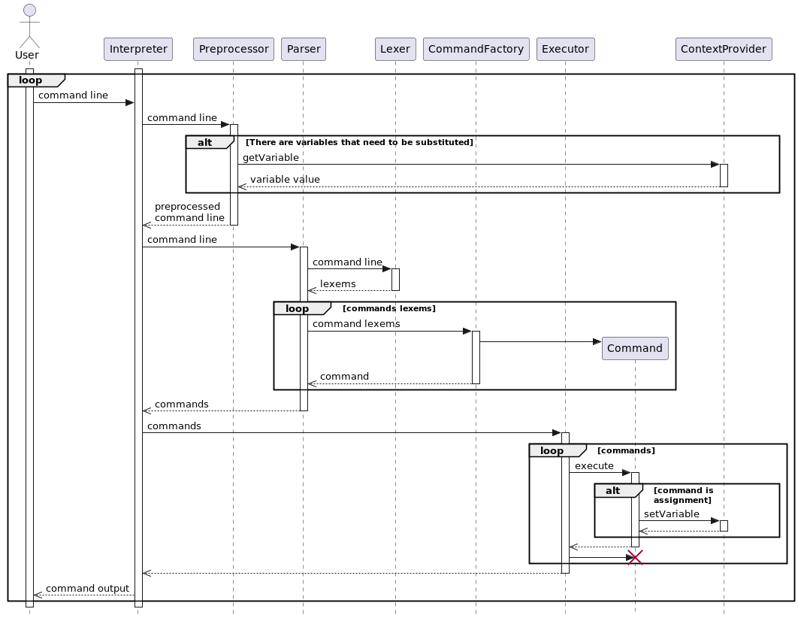

# CLI

Авторы:
- Шакиров Игорь
- Чучин Дмитрий

# Краткое описание работы CLI

Основной класс **Interpreter**, он запускает интерпретатор и ждет, пока пользователь введет команду. 
Затем входной поток передаётся **Preprocessor**, который при необходимости заменяет любые вхождения переменных, обозначенных символом «$», соответствующими значениями. 
Полученная обработанная строка передаётся **Lexer**, который разбивает ее на токены в виде односвязного списка и предоставляет их в качестве итератора с помощью команды NextToken() (итератором выступает сам лексер).  
Полученный Lexer передается в качестве аргумента конструктора классу **Parser**, который проходится по токенам и инициализирует список команд **Command** в виде массива. Поскольку команды в shell выполняются последовательно, соседние элементы массива соединяются с помощью механизма Pipeline. 
Полученный массив команд затем передается **Executor**, который исполняет команды. 
Сами комманды **CommandBase** принимают список аргументов, поток ввода и поток вывода. Executor гарантирует, что поток вывода одной команды станет потоком ввода следующей команды. Сами команды используют как список аргументов, так и поток ввода. 
Результатом Executor является выходной поток и логическое значение, указывающее, следует ли выйти из интерпретатора. Класс Interpreter получает этот результат и ожидает следующей команды, если команды выхода не было.

# Диаграмма классов

# Диаграмма последовательности

